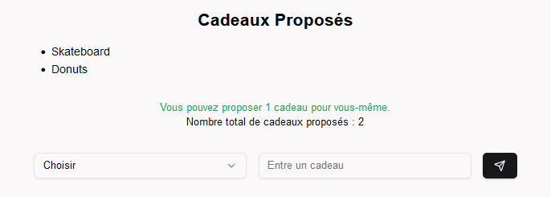

<!-- Improved compatibility of back to top link: See: https://github.com/othneildrew/Best-README-Template/pull/73 -->

<a id="readme-top"></a>

<!--
*** Thanks for checking out the Best-README-Template. If you have a suggestion
*** that would make this better, please fork the repo and create a pull request
*** or simply open an issue with the tag "enhancement".
*** Don't forget to give the project a star!
*** Thanks again! Now go create something AMAZING! :D
-->

<!-- PROJECT SHIELDS -->
<!--
*** I'm using markdown "reference style" links for readability.
*** Reference links are enclosed in brackets [ ] instead of parentheses ( ).
*** See the bottom of this document for the declaration of the reference variables
*** for contributors-url, forks-url, etc. This is an optional, concise syntax you may use.
*** https://www.markdownguide.org/basic-syntax/#reference-style-links
-->

[![Contributors][contributors-shield]][contributors-url]
[![Forks][forks-shield]][forks-url]
[![Stargazers][stars-shield]][stars-url]
[![Issues][issues-shield]][issues-url]

<!-- [![MIT License][license-shield]][license-url] -->

<!-- [![LinkedIn][linkedin-shield]][linkedin-url] -->

<!-- PROJECT LOGO -->
<br />
<div align="center">
  <a href="https://github.com/theoelsti/secret-santa-ng">
    
  </a>

<h3 align="center">Secret Santa New Generation</h3>

  <p align="center">
    An awesome secret santa app with gifts ideas and random generation!
    <br />
    <a href="https://github.com/theoelsti/secret-santa-ng"><strong>Explore the docs »</strong></a>
    <br />
    <br />
    <a href="https://github.com/theoelsti/secret-santa-ng">View Demo</a>
    ·
    <a href="https://github.com/theoelsti/secret-santa-ng/issues/new?labels=bug&template=bug-report---.md">Report Bug</a>
    ·
    <a href="https://github.com/theoelsti/secret-santa-ng/issues/new?labels=enhancement&template=feature-request---.md">Request Feature</a>
  </p>
</div>

<!-- TABLE OF CONTENTS -->
<details>
  <summary>Table of Contents</summary>
  <ol>
    <li>
      <a href="#about-the-project">About The Project</a>
      <ul>
        <li><a href="#built-with">Built With</a></li>
      </ul>
    </li>
    <li>
      <a href="#getting-started">Getting Started</a>
      <ul>
        <li><a href="#prerequisites">Prerequisites</a></li>
        <li><a href="#installation">Installation</a></li>
      </ul>
    </li>
    <li><a href="#usage">Usage</a></li>
    <li><a href="#roadmap">Roadmap</a></li>
    <li><a href="#contributing">Contributing</a></li>
    <li><a href="#license">License</a></li>
    <li><a href="#contact">Contact</a></li>
    <li><a href="#acknowledgments">Acknowledgments</a></li>
  </ol>
</details>

<!-- ABOUT THE PROJECT -->

## About The Project

![User Dashboard Screenshot][product-screenshot]

Secret Santa New Generation is a modern app that simplifies your Secret Santa organization. Here are the main features:

- 🔒 **Secure draw**: No one, not even the admin, can know who gives to whom
- 🎁 **Wishlist**: Each participant can create and manage their gift wishlist
- 💡 **Gift suggestions**: Ability to suggest ideas for other participants
- 📱 **Responsive interface**: Works on mobile, tablet, and desktop
- 👥 **Multiple groups**: Manage different Secret Santa groups

<p align="right">(<a href="#readme-top">back to top</a>)</p>

### Built With

- [![Next][Next.js]][Next-url]
- [![Tailwind][Tailwind]][Tailwind-url]
- [![Prisma][Prisma]][Prisma-url]

<p align="right">(<a href="#readme-top">back to top</a>)</p>

## Getting Started

This guide explains how to set up and deploy the application in different environments.

### Prerequisites

- Node.js 18+
- Git
- Docker (optional)

### Local Development Setup

1. Clone the repository

```sh
git clone https://github.com/theoelsti/secret-santa-ng.git
cd secret-santa-ng
```

2. Configure environment

```sh
# Copy example environment file
cp example.env .env

# Edit .env and set your variables
ADMIN_TOKEN="your_admin_token"
DATABASE_URL="file:./dev.db"
```

3. Install and run

```sh
# Install dependencies
npm install

# Initialize database
npx prisma migrate dev

# Run development server
npm run dev
# or
# Build and run production
npm run build
npm start
```

### Production Deployment

#### Using Docker (Recommended)

```sh
# Build the Docker image
docker build -t secret-santa-app .

# Run the container
docker run -p 3000:3000 \
  -e ADMIN_TOKEN="your_admin_token" \
  -e DATABASE_URL="file:./prod.db" \
  secret-santa-app
```

#### Using Vercel

1. Fork the repository
2. Connect to Vercel
3. Import the project
4. Add environment variables in Vercel dashboard
5. Deploy!

The application will be available at `http://localhost:3000` for local development or your deployment URL for production.

<!-- USAGE EXAMPLES -->

## Usage

### For administrators

1. **Create a family**

   - Log in with your admin token
   - Click on "Ajouter une famille"
   - Enter Family name
   - Add members and add their name
   - When done, click "Générer le Secret Santa"

   

###### You wil be redirected on the users management page

2. **Share the word**
   - You can copy a message or the user token
   - Send it 1 by 1 to every participants
   - They will have an url that put the token in cookies directly

### For participants

1. **Getting started**

   - Log in to the dashboard
   - See the person you're offering to

2. **Giving ideas for gifts**
   - Select a participant, can be you 1 time
   - Enter the gift in the input
   - Send it !



_For more examples, please refer to the [Documentation](https://example.com)_

<p align="right">(<a href="#readme-top">back to top</a>)</p>

<!-- CONFIGURATION -->

## Configuration

### Environment Variables

```env
# Required
ADMIN_TOKEN="your_admin_token"
DATABASE_URL="your_database_url"
```

<!-- ROADMAP -->

## Roadmap

- [ ] 📨 Email notifications
- [ ] 🌐 Multi-language support (FR, EN)
- [ ] 🔄 Integration with Amazon/Etsy for wishlists
- [ ] 🎨 Dark Theme
- [ ] 📊 Advanced admin features
  - [ ] Add a deadline
  - [ ] Set a budget

See the [open issues](https://github.com/theoelsti/secret-santa-ng/issues) for a full list of proposed features (and known issues).

<p align="right">(<a href="#readme-top">back to top</a>)</p>

<!-- CONTRIBUTING -->

## Contributing

Contributions are what make the open source community such an amazing place to learn, inspire, and create. Any contributions you make are **greatly appreciated**.

If you have a suggestion that would make this better, please fork the repo and create a pull request. You can also simply open an issue with the tag "enhancement".
Don't forget to give the project a star! Thanks again!

1. Fork the Project
2. Create your Feature Branch (`git checkout -b feature/AmazingFeature`)
3. Commit your Changes (`git commit -m 'Add some AmazingFeature'`)
4. Push to the Branch (`git push origin feature/AmazingFeature`)
5. Open a Pull Request

- 🐛 [Report a bug](https://github.com/theoelsti/secret-santa-ng/issues/new?labels=bug&template=bug-report---.md)
- 💡 [Request a feature](https://github.com/theoelsti/secret-santa-ng/issues/new?labels=enhancement&template=feature-request---.md)

<p align="right">(<a href="#readme-top">back to top</a>)</p>

### Top contributors:

<a href="https://github.com/theoelsti/secret-santa-ng/graphs/contributors">
  
</a>

<!-- LICENSE -->

## License

Distributed under the MIT License. See `LICENSE.txt` for more information.

<p align="right">(<a href="#readme-top">back to top</a>)</p>

<!-- CONTACT -->

## Contact

<!-- Your Name - [@twitter_handle](https://twitter.com/twitter_handle) - email@email_client.com -->

Project Link: [https://github.com/theoelsti/secret-santa-ng](https://github.com/theoelsti/secret-santa-ng)

<p align="right">(<a href="#readme-top">back to top</a>)</p>

<!-- ACKNOWLEDGMENTS -->

## Acknowledgments

- []()
- []()
- []()

<p align="right">(<a href="#readme-top">back to top</a>)</p>

<!-- MARKDOWN LINKS & IMAGES -->
<!-- https://www.markdownguide.org/basic-syntax/#reference-style-links -->

[contributors-shield]: https://img.shields.io/github/contributors/theoelsti/secret-santa-ng.svg?style=for-the-badge
[contributors-url]: https://github.com/theoelsti/secret-santa-ng/graphs/contributors
[forks-shield]: https://img.shields.io/github/forks/theoelsti/secret-santa-ng.svg?style=for-the-badge
[forks-url]: https://github.com/theoelsti/secret-santa-ng/network/members
[stars-shield]: https://img.shields.io/github/stars/theoelsti/secret-santa-ng.svg?style=for-the-badge
[stars-url]: https://github.com/theoelsti/secret-santa-ng/stargazers
[issues-shield]: https://img.shields.io/github/issues/theoelsti/secret-santa-ng.svg?style=for-the-badge
[issues-url]: https://github.com/theoelsti/secret-santa-ng/issues
[license-shield]: https://img.shields.io/github/license/theoelsti/secret-santa-ng.svg?style=for-the-badge
[license-url]: https://github.com/theoelsti/secret-santa-ng/blob/master/LICENSE.txt
[linkedin-shield]: https://img.shields.io/badge/-LinkedIn-black.svg?style=for-the-badge&logo=linkedin&colorB=555
[linkedin-url]: https://linkedin.com/in/linkedin_username
[product-screenshot]: images/dashboard.png
[Next.js]: https://img.shields.io/badge/next.js-000000?style=for-the-badge&logo=nextdotjs&logoColor=white
[Next-url]: https://nextjs.org/
[Tailwind]: https://img.shields.io/badge/Tailwind_CSS-grey?style=for-the-badge&logo=tailwind-css&logoColor=38B2AC
[Tailwind-url]: https://tailwindcss.com/
[Prisma]: https://img.shields.io/badge/Prisma-3982CE?style=for-the-badge&logo=Prisma&logoColor=white
[Prisma-url]: https://www.prisma.io/
[React.js]: https://img.shields.io/badge/React-20232A?style=for-the-badge&logo=react&logoColor=61DAFB
[React-url]: https://reactjs.org/
[Vue.js]: https://img.shields.io/badge/Vue.js-35495E?style=for-the-badge&logo=vuedotjs&logoColor=4FC08D
[Vue-url]: https://vuejs.org/
[Angular.io]: https://img.shields.io/badge/Angular-DD0031?style=for-the-badge&logo=angular&logoColor=white
[Angular-url]: https://angular.io/
[Svelte.dev]: https://img.shields.io/badge/Svelte-4A4A55?style=for-the-badge&logo=svelte&logoColor=FF3E00
[Svelte-url]: https://svelte.dev/
[Laravel.com]: https://img.shields.io/badge/Laravel-FF2D20?style=for-the-badge&logo=laravel&logoColor=white
[Laravel-url]: https://laravel.com
[Bootstrap.com]: https://img.shields.io/badge/Bootstrap-563D7C?style=for-the-badge&logo=bootstrap&logoColor=white
[Bootstrap-url]: https://getbootstrap.com
[JQuery.com]: https://img.shields.io/badge/jQuery-0769AD?style=for-the-badge&logo=jquery&logoColor=white
[JQuery-url]: https://jquery.com
